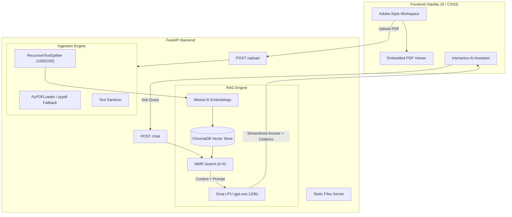

# 📄 SastaPDF AI
### *The Adobe Acrobat-Inspired Intelligent Document RAG Workspace*

[](https://sasta-pdf.onrender.com/)
[](https://www.python.org/)
[](https://fastapi.tiangolo.com/)
[](https://www.langchain.com/)
[](https://www.trychroma.com/)
[](https://groq.com/)
[](https://mistral.ai/)
[](LICENSE)

---

> 🚀 **Experience it Live:** [https://sasta-pdf.onrender.com/](https://sasta-pdf.onrender.com/)

**SastaPDF AI** is a modern, high-performance **Retrieval-Augmented Generation (RAG)** application designed for seamless PDF document interaction. Inspired by Adobe Acrobat's professional layout, it combines split-pane PDF viewing with ultra-low latency contextual question-answering powered by **Groq LPU inference** and **Mistral AI embeddings**.

---

## 🌟 Key Features

- ⚡ **Ultra-Fast LLM Inference**: Powered by **Groq** (`gpt-oss-120b`) delivering lightning-fast conversational responses with deterministic document grounding (strictly anti-hallucination).
- 🧠 **Dense Semantic Retrieval**: Employs **Mistral AI Embeddings** (`mistral-embed`) combined with **ChromaDB** persistent vector storage.
- 🎯 **Maximal Marginal Relevance (MMR)**: Balances query relevance and context diversity during retrieval (`k=5`, `fetch_k=15`, `lambda_mult=0.5`).
- 🛡️ **Document-Isolated Vector Store**: Every uploaded document receives an isolated UUID namespace, preventing cross-document context contamination.
- 📖 **Interactive Split-Pane Workspace**:
  - Embedded in-browser PDF reader with zoom and navigation controls.
  - Document sidebar for instant file switching, metadata tracking, and single-click deletion.
  - Conversational AI assistant with page-referenced citations (`[Page X]`) and prompt recommendations.
- 🌓 **Dynamic Theme Engine**: Smooth dark and light mode toggle with state persistence.
- 🔄 **Fault-Tolerant Ingestion Pipeline**:
  - Primary parsing via `PyPDFLoader` with an automatic fallback to `pypdf.PdfReader`.
  - Content sanitization, encoding normalization, and recursive chunking with customizable overlap.
  - Built-in file size validation (10MB limit) and sanitized filename generation.

---

## 🏛️ System Architecture



---

## 🛠️ Technology Stack

| Layer | Technologies |
| :--- | :--- |
| **Frontend** | Vanilla HTML5, Modern CSS3 (Grid/Flexbox, Glassmorphism, CSS Variables), ES6+ JavaScript |
| **API Backend** | [FastAPI](https://fastapi.tiangolo.com/), [Uvicorn](https://www.uvicorn.org/), Pydantic |
| **Orchestration** | [LangChain](https://www.langchain.com/) (LangChain Core, LangChain Community, LangChain Text Splitters) |
| **Embeddings** | [Mistral AI Embeddings](https://mistral.ai/) (`mistral-embed`) |
| **Vector Database** | [ChromaDB](https://www.trychroma.com/) (Local persistent storage) |
| **Inference / LLM** | [Groq](https://groq.com/) Cloud (`openai/gpt-oss-120b`) |
| **PDF Parsing** | [PyPDF](https://pypi.org/project/pypdf/), PyPDFLoader |
| **Hosting & Cloud** | [Render](https://render.com/) |

---

## 🚀 Quickstart Guide

### Prerequisites

- **Python 3.10+** installed
- Free API keys from:
  - [Groq Console](https://console.groq.com/)
  - [Mistral AI Console](https://console.mistral.ai/)

---

### 1. Clone the Repository

```bash
git clone https://github.com/yoloaryan/Sasta_PDF.git
cd Sasta_PDF
```

---

### 2. Configure Environment Variables

Create your `.env` file in the `backend/` directory:

```bash
cp backend/.env.example backend/.env
```

Add your API credentials to `backend/.env`:

```env
GROQ_API_KEY=gsk_your_groq_api_key_here
MISTRAL_API_KEY=your_mistral_api_key_here
```

---

### 3. Setup Virtual Environment & Install Dependencies

#### On macOS / Linux:
```bash
cd backend
python3 -m venv .venv
source .venv/bin/activate
pip install -r requirements.txt
```

#### On Windows:
```cmd
cd backend
python -m venv .venv
.venv\Scripts\activate
pip install -r requirements.txt
```

---

### 4. Run the Application

Start the unified FastAPI server (which automatically serves both the backend API and the static frontend):

```bash
python main.py
```

The application will be live at:
👉 **[http://localhost:8000](http://localhost:8000)**

*(Optional: If developing the frontend independently, you can also run `python -m http.server 5500` inside `frontend/` and access `http://127.0.0.1:5500`)*.

---

## 📡 REST API Reference

| Method | Endpoint | Description | Payload / Parameters |
| :--- | :--- | :--- | :--- |
| `POST` | `/upload` | Upload & ingest a PDF into ChromaDB | `multipart/form-data` (`file: .pdf`) |
| `POST` | `/chat` | Ask questions grounded in uploaded PDF | `{"question": "...", "document_id": "..."}` |
| `DELETE` | `/documents/{document_id}` | Remove document vectors and local file | `filename` (optional query param) |
| `GET` | `/health` | Service health status | *None* |
| `GET` | `/files/{filename}` | Stream uploaded PDF for in-browser viewer | *None* |

---

## 📁 Repository Structure

```
Sasta_PDF/
├── backend/
│   ├── chroma-db/          # Persistent ChromaDB vector storage
│   ├── uploads/            # Staged PDF documents
│   ├── database.py         # Vectorstore and embedding initialization
│   ├── ingestion.py        # PDF extraction, sanitization & chunking
│   ├── main.py             # FastAPI routing and static mounting
│   ├── rag.py              # MMR retrieval and Groq LLM integration
│   ├── requirements.txt    # Python backend dependencies
│   ├── .env.example        # Environment variable template
├── frontend/
│   ├── index.html          # Application markup (Adobe-inspired UI)
│   ├── style.css           # Modern design system & responsive layout
│   ├── script.js           # Client application logic & API bridge
│   ├── avatar.png          # UI assets
├── render.yaml             # Render deployment configuration
├── vercel.json             # Vercel configuration
└── README.md               # Project documentation
```

---

## ☁️ Deployment on Render

This project includes a native [`render.yaml`](file:///Users/aryangupta/Desktop/RAG-Project/render.yaml) blueprint:

1. Connect your repository to [Render](https://render.com/).
2. Create a new **Web Service** or use the **Blueprint** deployment.
3. Configure the following environment variables in your Render dashboard:
   - `GROQ_API_KEY`: Your Groq API key
   - `MISTRAL_API_KEY`: Your Mistral API key
   - `RENDER`: `true`
4. The service will build and launch automatically using:
   ```bash
   uvicorn main:app --host 0.0.0.0 --port $PORT
   ```

Live Deployment URL: **[https://sasta-pdf.onrender.com/](https://sasta-pdf.onrender.com/)**

---

## 🤝 Contributing

Contributions, issues, and feature requests are welcome! Feel free to check the [issues page](https://github.com/yoloaryan/Sasta_PDF/issues).

1. Fork the Project
2. Create your Feature Branch (`git checkout -b feature/AmazingFeature`)
3. Commit your Changes (`git commit -m 'Add some AmazingFeature'`)
4. Push to the Branch (`git push origin feature/AmazingFeature`)
5. Open a Pull Request

---

## 📄 License

Distributed under the MIT License. See `LICENSE` for more information.

---

<div align="center">
  <sub>Built with ❤️ by <a href="https://github.com/yoloaryan">Aryan Gupta</a></sub>
</div>
